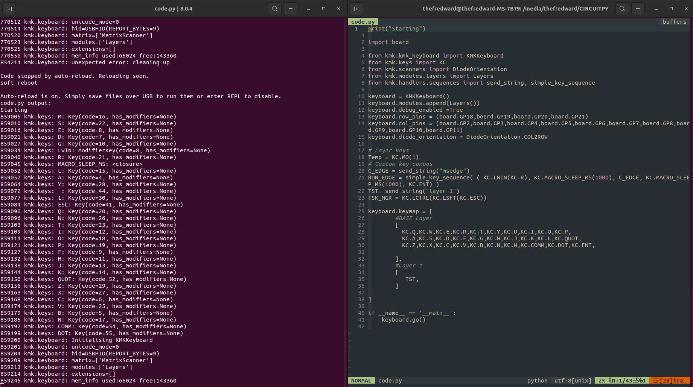
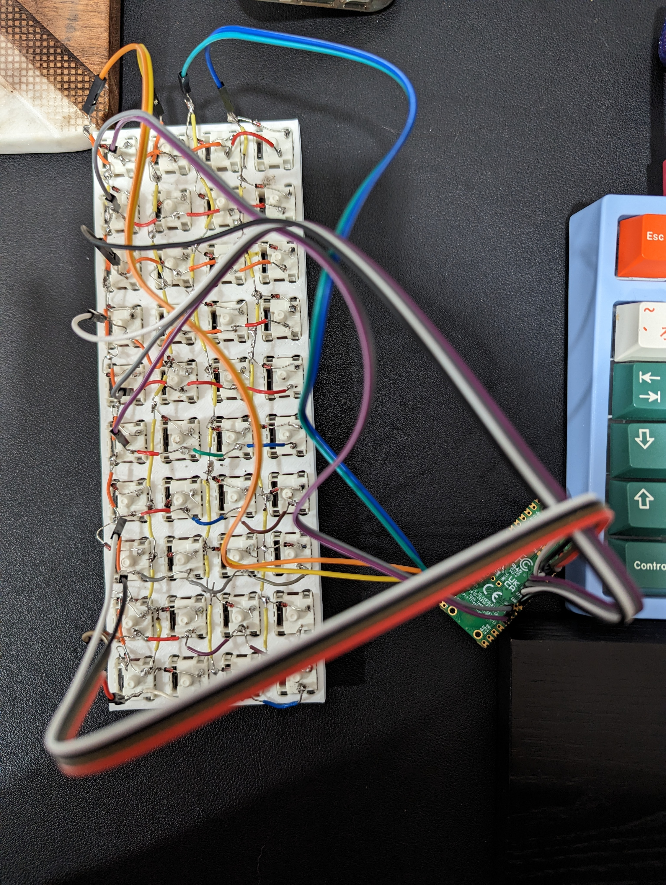
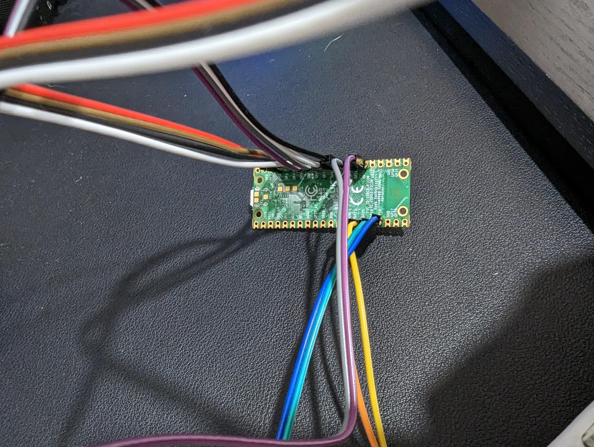
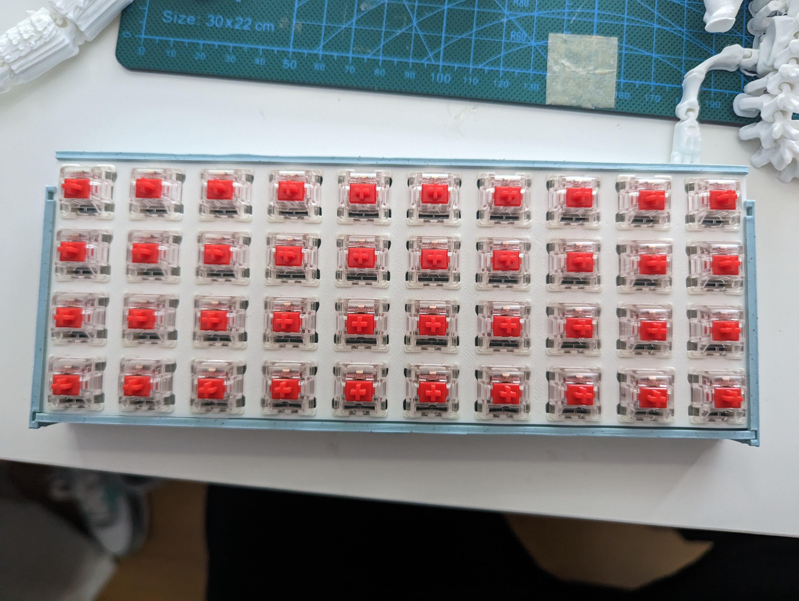
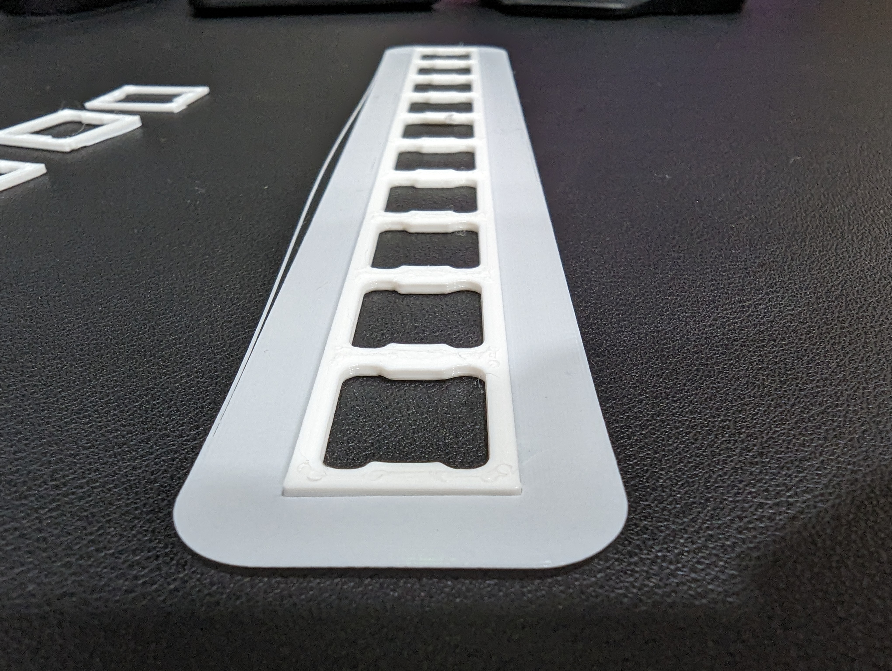
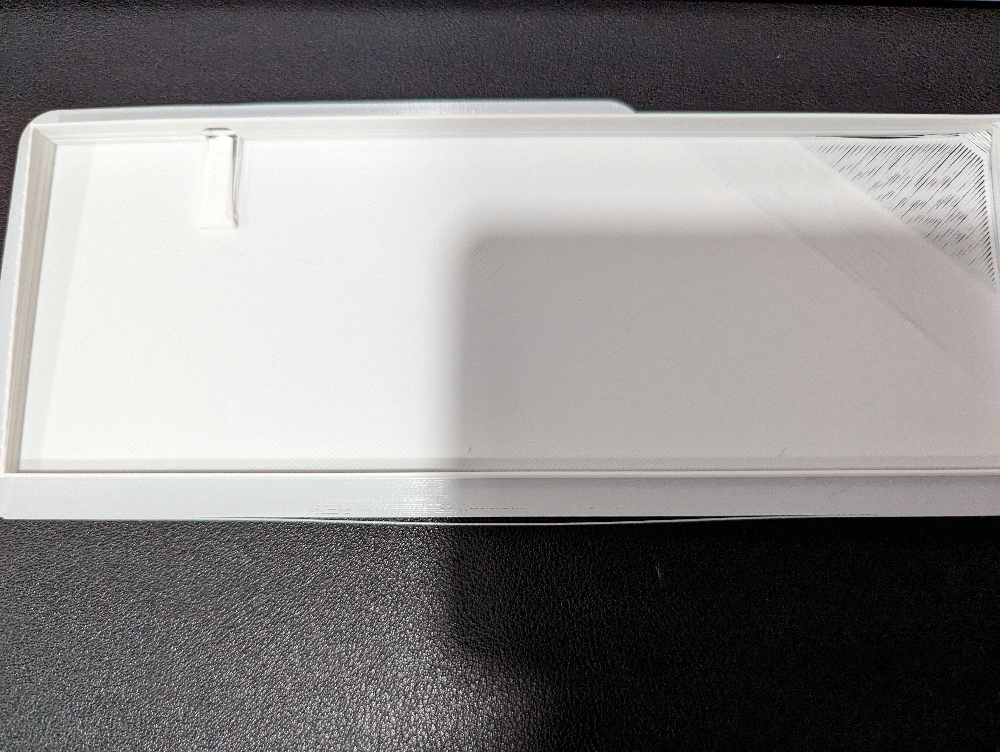
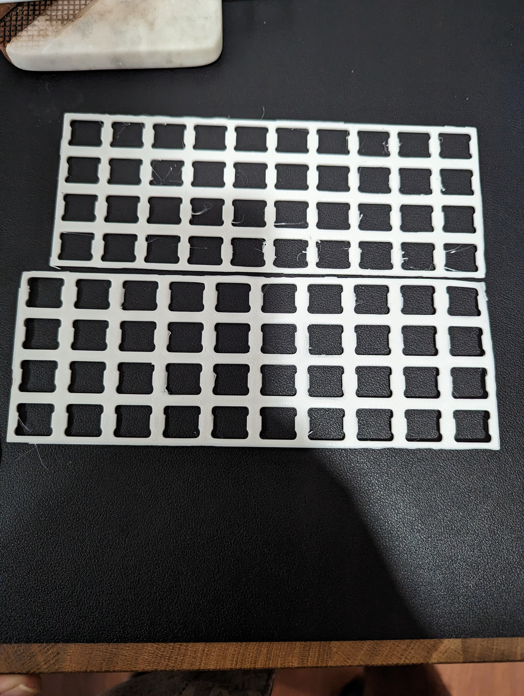
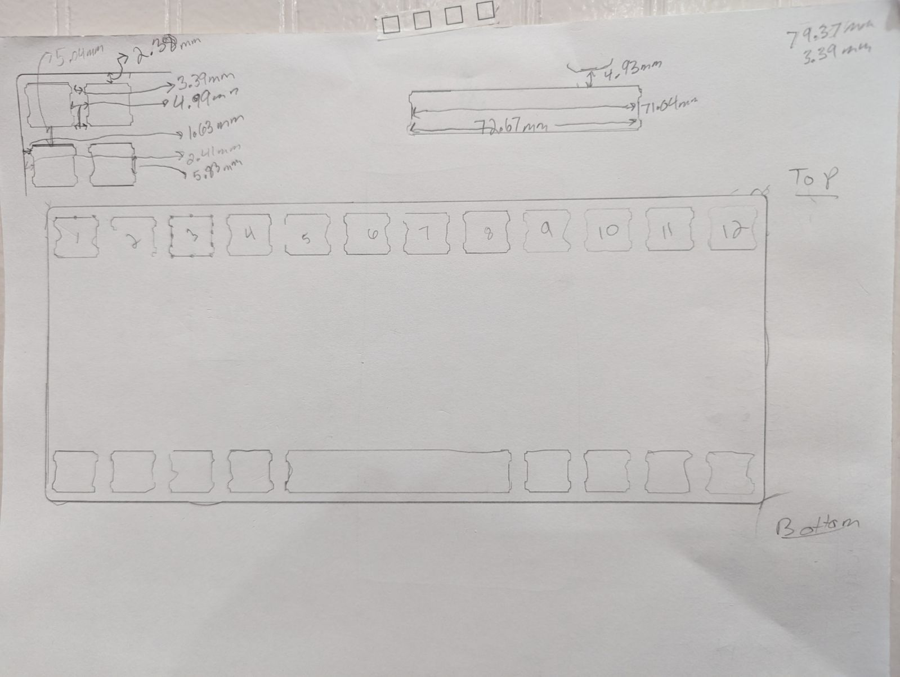

#Objective
 

Want to make my own ~40% keyboard, I started by referencing preonic ortholinear keyboard.For the project I'm using **Blender** for modelling and designing prototypes, and a Biqu B1 FDM 3D printer to print prototypes. To drive this keyboard I will be using a Raspberry Pi Pico W with KMK Software.
 

## Tasks
 - [x] Take measurements of a pre-existing plate
 - [x] Develop and protype a switch plate for a single keyboard switch
 - [x] Create a 10 column single row
 - [x] Print protype
 - [x] Solder the Diodes and switches
 - [ ] Assemble base frame
 - [x] Program the 40% keyboard
 - [ ] Build the base and attach the switch frame
  

### Current Task
 

Working on the code and debbuging; still deciding on how th set the last row currently just have the first 30 keys assigned.
 

 

### Task Notes
< 

Added the diodes and chose the pins to use on the Raspberry Pi W.
 

 

 

br>
 

Second and Third Task Notes
- Took measurements created prototypes
- Tested found the best fitting, used ***Gateron yellow switches***
- The wedge that holds the switch still feels a little bit tight, May reduce by 1 mm
- Chose a thickness of 1300 mm 
- ***NOTE: When Importing STL file into Cura 4.13 it changes the 1300 mm to 1.3 mm***
- With final thinkness I went ahead and started developing the switch frame plate
- I created the 40 key array at two different sizes to test 
- Attempted to build the body frame but it failed during the print
 

 

 

 

First Task Notes
- Started by taking measurements of a preonic ortholinear keyframe 
- On Blender created a single switch holder, purpose was to verify that the measurements where correct and perform any adjustments

